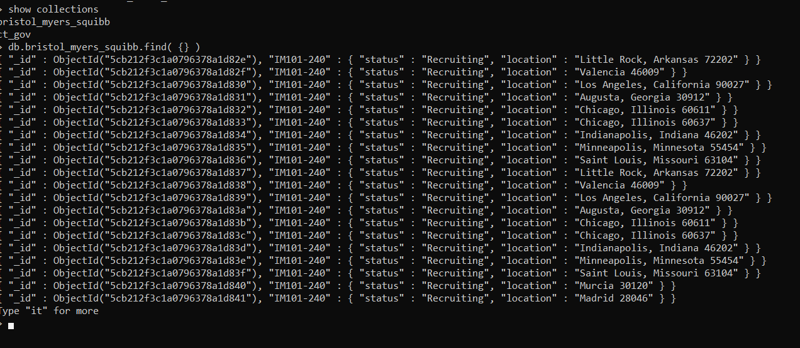
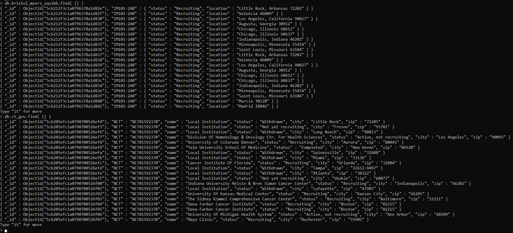

# ct-ETL
---

## Purpose: 
Perform ETL process on location data from clinicaltrials.gov and bmsstudyconnect.com to compare locations available on each site.  This project aims to scrape location data from a given trial url and store the data in a MongoDB database.   

## Data Sources:
- Clinicaltrials.gov (XML)
- bmsstudyconnect.com (HTML)

## Data Scraped:
- Status (recruiting or not)
- Location (city and zip-code)
- Trial ID (research tag)

## Tools Used
- Jupyter Notebook (Python IDE)
- BeautifulSoup (HTML parser)
- PyMongo (MongoDB ORM)
- chromedriver.exe (Driver for asynchronous parsing)
- Selenium (Allows for asynchronous parsing control in Python)

## Database Considerations:
MongoDB was used for this project because a non-relational database is useful for warehousing data sets that will be growing over time.  A nested json structure will be easier to work with as we continue to collect location data for different research tags from different websites.

The database collections are organised by the website the data was scraped from.  The two collections are named based on the site they were scraped from.  The final output of the databases from mongo Shell are shown bellow:

### BMS Study Connect:

### ClinicalTrials.gov:

## Transformation Process for each website:

 

