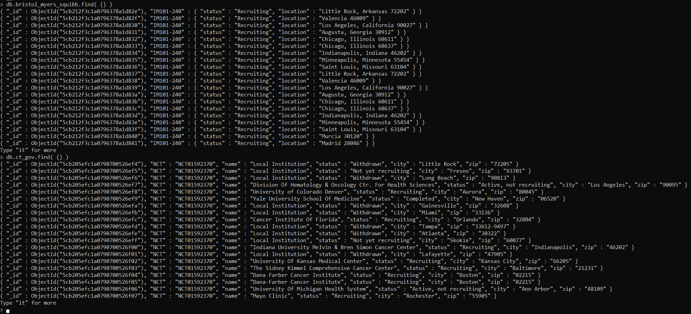

# ct-ETL
---

## Purpose: 
Perform ETL process on location data from clinicaltrials.gov and bmsstudyconnect.com to compare locations available on each site.  This project aims to scrape location data from a given trial url and store the data in a MongoDB database.   

## Data Sources:
- Clinicaltrials.gov (XML)
- bmsstudyconnect.com (HTML)

## Data Scraped:
- Status (recruiting or not)
- Location (city and zip-code)
- Trial ID (research tag)

## Tools Used
- Jupyter Notebook (IDE)
- BeautifulSoup (HTML parser)
- PyMongo (MongoDB ORM)
- chromedriver.exe (Driver for asynchronous parsing)
- Selenium (Allows for asynchronous parsing control in Python)

## Database Considerations:
We decided to use MongoDB (non-relational) as our database of choice over MySQL (relational).  This is for the following reasons:
1. With the removal or addition of new or existing columns (frequent schema changes), MongoDB is the better choice in terms of warehouse maintenance.
2. A nested json structure is used to store data in a one-to-many relationship in MongoDB, which is easier to work with without RDBMS expertise.
3. There is no need for multiple transactions for this particular set of data, and with the amount of data potentially growing exponentially over time, MongoDB is the better choice for horizontal scaling.

### ClinicalTrials.gov and BMS Study Connect mongo Shell output:


## ETL Process for each website:

### BMS Study connect:
1. Using chromedriver, Selenium, and BeautifulSoup the html was scraped from the page source.
2. Time delay was needed because the page load was slow.
3. Class definition for scraping was determined and then span was used to find the trial id.
4. Collected trial id, location, & recruiting status- had to replace “\n” and “ ” characters.
5. Insert into MongoDB collection.

#### Code snippet for asynchronous HTML scraping:
```python
# Chromedriver set-up
executable_path = {'executable_path': 'chromedriver.exe'}
browser = webdriver.Chrome(**executable_path)
url = 'https://www.bmsstudyconnect.com/content/studyconnect/us/en/sites-list.html?id=NCT01357668&language=en&geo_lati=&geo_long=&location='
browser.get(url)

# 20 second time delay is so that the page can load and all information can be scraped
time.sleep(20)

# Scrape the html on the site after the timer is done
html = browser.page_source
soup = BeautifulSoup(html, 'html.parser')

# set the class definition to only find divs that match a specific kind of class
research_divs = soup.find_all("div", {"class": "grid-x grid-margin-x bmssc-result-item bmssc-site-result"})

# find the trial_id from the page as well
trial_id = soup.find("span", id="trail-id-each").text
```

#### Code snippet for HTML Parsing and MongoDB loading:
```python
# Loop through returned results in research_divs
# These list boxes contain the research site locations and their current recruitment status
for result in research_divs:
    # Error handling
    # Handles cases where HTML atributes do not exist within a particular result in the research_divs list
    try:
        # Return the location of the research site
        location = result.find('div', class_ = "bmssc-type-medium--alternate bmssc-color-dark-grey").text
        
        # Case 1: The research site is currently Recruiting
        is_recruiting = result.find('div', class_="hide-for-medium bmssc-status--indicator is-recruiting active").text
        
        #Transform data
        # Modify strings
        is_recruiting = is_recruiting.replace(" ", "")
        is_recruiting = is_recruiting.replace("\n", "")
        
        # update location_dict
        location_dict = { trial_id: { "status" : is_recruiting, "location": location} }

        # insert into the collection
        collection.insert_one(location_dict)
    
    # Make exception for html attribute not existing
    except AttributeError as e:
        # Case 2: The research site is not recruiting yet 
        not_recruiting = result.find('div', class_="hide-for-medium bmssc-status--indicator is-notyetrecruiting active").text
        
        # Transform Data
        # Modify strings
        not_recruiting = not_recruiting.replace(" ", "")
        not_recruiting = not_recruiting.replace("\n", "")
        
        # update location_dict
        location_dict = { trial_id: { "status" : not_recruiting, "location": location} }
        
        # insert into the collection
        collection.insert_one(location_dict)
```

### ClinicalTrials.gov:
1. Using requests and beautiful soup we pulled data using ct.gov URL by nctID.
2. Appended site name, recruiting status, city, and zip to dictionary. 
3. Loaded records into a json.
4. Using a for loop records were inserted row by row into MongoDB.

#### Code snippet for extraction process:
Bellow is a code snippet of the function used to extract from ClinicalTrials.gov:
```python
# Input: Research id used for querying from clinicaltrials.gov
# Ouput: Returns a dictionary of lists of cleaned XML site data
# Purpose: Function takes a nctid string as input and ouputs cleaned XML data.
#          The nctid is querried in the website using the request.get(URL) method.
#          This queried xml is loaded into a soup object, which is then used
#          to parse the xml into the "data" dictionary list object.
def clinicalTrialsGov(nctid):
    
    # Initialize dictionary list
    data = defaultdict(list)
    
    # Load XML into soup object
    soup = BeautifulSoup(requests.get("https://clinicaltrials.gov/ct2/show/"\
                                      + nctid + "?displayxml=true").text, "xml")
    
    # Create list of tags that will be scraped from the "soup" object
    subset = ['name','status','city', 'zip']
    
    # Find all subset tags in the soup object
    for tag in soup.find_all(subset):
        # Transform the found location data and put into the "data" object
        data['ct{}'.format(tag.name.capitalize())].append(tag.get_text(strip=True))
    
    # Return the "data" object
    return data

# Create a dictionary of scraped data for the NCT01592370 tag
data = clinicalTrialsGov('NCT01592370')
```


 


